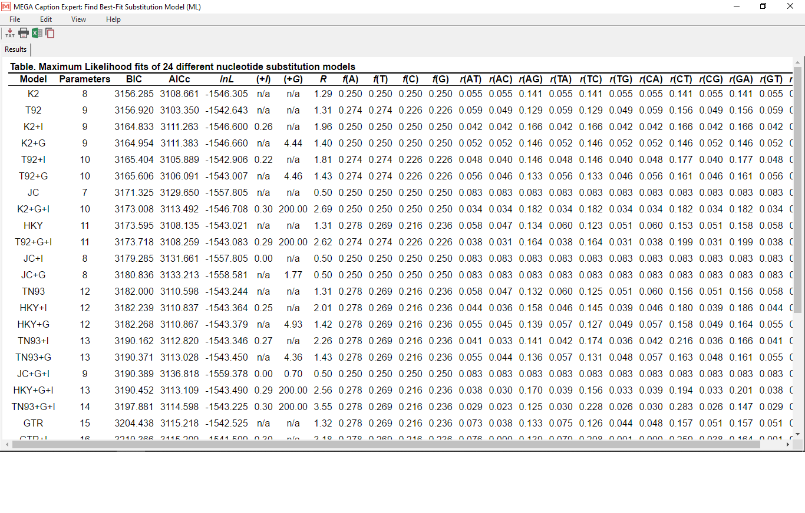
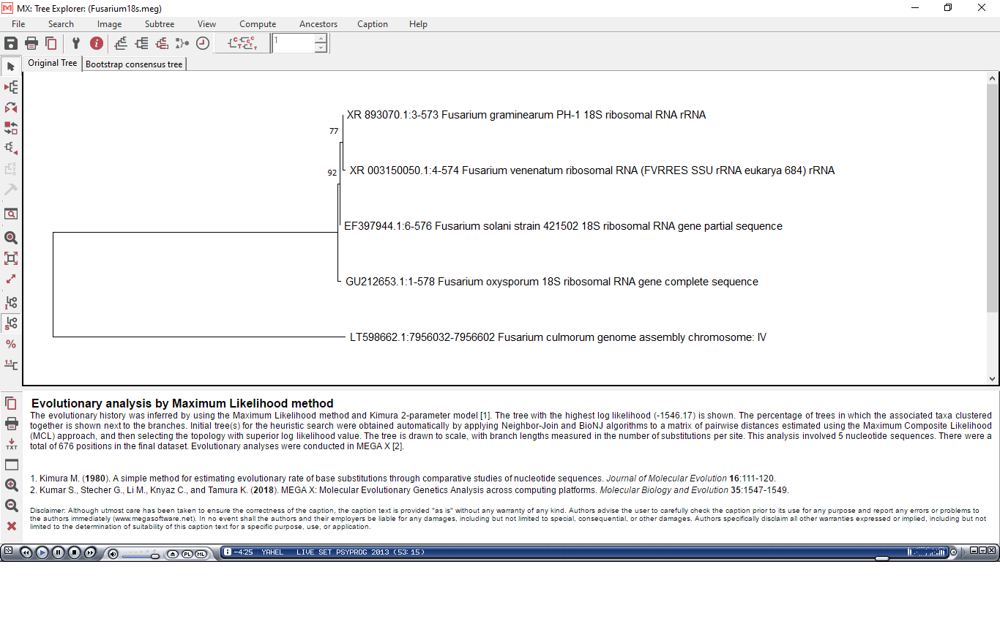
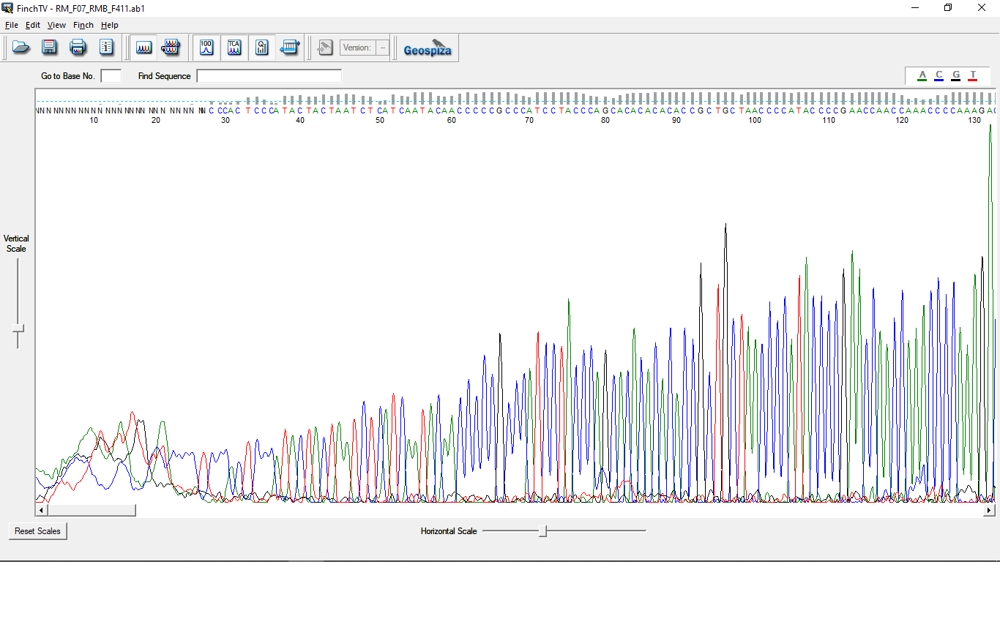

# Sesión 1. ¿Qué es la bioinformática?  
Bioinformática es un conjunto de técnicas y algoritmos computacionales aplicadas a datos biológicos. Es una nueva área de estudio que combina biología molecular con ciencias computacionales. Un reto mayor que la bioinformática enfrenta es organizar la gran cantidad de información obtenida gracias a las nuevas tecnologías de secuenciación. Veamos ¿qué es la bioinformática? en esta [presentación](https://docs.google.com/presentation/d/1ELPMuwxz9no_BEKIPr4la0CtLt4d1LMicqorxCdjjDs/edit#slide=id.g5a4b1e4ece_0_0)

### La información Biológica se almacena en grandes bases de datos.  
Las bases de datos que almacenan información biológica pueden ser públicas o privadas. En ellas, los usuarios acumulan información de los organismos. Esta información es usualmente procesada por algún paquete de análisis para proporcionar una visualización.  

#### [The National Center for Biotechnology Information NCBI](https://www.ncbi.nlm.nih.gov/)  
NCBI es una de las grandes bases de datos biológicas contiene información de una extensa variedad de organismos incluyendo genes, genomas, proteinas, clasificación taxonómica, etc.  

Ejemplo de búsqueda en NCBI:
1. Búsqueda individual
   Ve a la página de NCBI y escribe mitochondrial en el buscador  
   ¿Qué resultados te salen?  
   
2. Búsqueda con modificadores AND y NOT   
 De hecho NCBI agrupa varias bases de datos, vamos a explorar taxonomy y nucleotide. Selecciona Nucleotide como base de datos y realiza la siguiente búsqueda.   
   
`"mitochondrial" [title]AND "D-loop"[title] NOT "segment"[title] AND "homo" [organism]  `    
  
¿Qué obtienes?  

### El formato fasta  
En bioinformática los formatos de los archivos son importantes para su posterior tratamiento. Nosotros necesitaremos el formato fasta para posteriores análisis. Por ello haremos un ejercicio para que te familiarices con él. Este formato consiste en una línea con el símbolo '>' antes del nombre identificador de la secuencia, y después un salto de línea y la secuencia como tal.  
  

# Sesión 1: Generación de base de datos de Fusarium 

## Búsqueda de secuencias en NCBI 

Entra al sitio web de [NCBI](https://www.ncbi.nlm.nih.gov/) y busca el gen de interés con el que se realizará el árbol, específicando en primer lugar el organismo. En este ejemplo usaremos Fusarium oxysporum 18s.  Después, da click en el primer resultado titulado "Fusarium oxysporum 18S ribosomal RNA gene, complete sequence".  

Da click en donde dice rRNA, se seleccionará la secuencia y en la parte inferior del navegador aparecerá un recuadro, da click en FASTA. Verás una página web nueva donde debes ver la secuencia de nucleótidos, selecciónala y cópiala en el portapapeles.  
  
La secuencia copiada será utilizada para buscar secuencias similares en la base de datos del National Center of Biotechnology Information de Estados Unidos.

Ve al sitio web de [BLAST](https://blast.ncbi.nlm.nih.gov/Blast.cgi) y da click en "Nucleotide BLAST" y en el recuadro pega la secuencia del gen 18s de rRNA copiada anteriormente. Después, ve a la parte inferior de la página y da click en "BLAST".   Los resultados aparecerán en unos minutos.  
  
En la tabla de resultados revisa los valores de "E.value" y "Query cover" y selecciona las 5 secuencias más parecidas, da click en "Download/FASTA aligned" y guarda el archivo con el nombre "Fusarium_18s.fasta". Es importante no usar espacios o caracteres especiales en los nombres de los archivos ya que pueden generar errores en algunos softwares.  ¿Recuerdas la estructura de un archivo fasta?  

  

Para generar una buena base de datos es necesario obtener la mayor cantidad de secuencias posibles que representen la mayoría de las especies y subespecies que te interesan. Además, es importante no tener redundancia en las secuencias, ya que con esto serán mas lentos los siguientes pasos.

## Crear un alineamiento multiple de secuencias utilizando la base datos
Abre el programa MEGA y da click en "Align" y después en "Edit/Build Aligment". Selecciona "Retrieve a sequence from a file". Selecciona el archivo recién descargado de BLAST, recuerda que debe de tener la extensión .fasta. En el recuadro selecciona "ADN". Aparecerá una nueva ventana donde verás las secuencias descargadas de BLAST.

Da un vistazo a las secuencias, ¿es fácil saber si son similares?  
Ahora alinearemos las secuencias para observar mejor su similitud. Selecciona todas las secuencias y da click en la imagen con un brazo y la leyenda "Align with the MUSCLE algorithm" y después "Align DNA".

  

¿Son similares las secuencias? ¿Hay alguna secuencia que no se parezca las demás?    
Parece que la secuencia "LT598662.1:7956032-7956602_Fusarium_culmorum_genome_assembly_chromosome_IV" no corresponde al gen, ¿cuál puede ser la causa?  

Da click derecho en una de las secuencias, aparecerá un menú, da click en "Undo" para deshacer el alineamiento.  
Selecciona la secuencia "LT598662.1:7956032-7956602_Fusarium_culmorum_genome_assembly_chromosome_IV", da click derecho y selecciona "Reverse complement", deberás obtener la cadena complementaria en sentido reverso de la secuencia original.   Repite los pasos para generar el alineamiento. ¿Se ve mejor el alineamiento?.  

Una vez alineado podemos observar mejor las diferencias entre las secuencias dando click en "Display/Toggle Conserved Sites/at 100% Level". Estos cambios en la secuencia son los que nos dan información para poder construir los árboles filogenéticos más adelante, asumiendo que entre más parecidas son las secuencias los organismos están más relacionados genéticamente.  

## Construcción de un árbol filogenético

Como primer paso debemos encontrar un modelo de sustitución nucleótidica adecuado para nuestro set de datos. ¿Qué significa esto?  
Cambia de ventana en MEGA y da click en "MODEL" y "Find Best DNA/Protein Models (ML)". Dejamos los valores que aparecen en el recuadro y damos click en "OK". Observa la tabla de resultados, en orden descendente aparecerán en la tabla los modelos que expliquen mejor los cambios observados en cada sitio variable (sustitución nucleotídica). Los modelos con el score BIC más bajo son considerados como aquellos que describen mejor los patrones de sustitución observados. En este ejemplo el mejor modelo es "K2", por lo que éste será utilizado para inferir el árbol filogenético.

Ahora da click en  "PHYLOGENY" en la ventana principal de MEGA. Cambia el modelo de sustitución por "Kimura 2-parameter model" o "K2".  

Además, incluiremos un "control de calidad" al árbol con el que se evalúa la probabilidad de que la posición de cada rama del árbol sea inferida correctamente. Para ésto da click en "Test of Phylogeny" y selecciona "Boostrap method". A continuación escribe 100 en "No. of Boostrap Replications" y da click en "OK". Esperamos un poco mientras corre el programa, observaremos el árbol filognético en una nueva ventana. 
¿Cuál es la cantidad mínima de boostraps necesarios para obtener un árbol fidedigno?  
¿Qué significan los números en las ramas del árbol?

  

Puedes utilizar lo aprendido para inferir la especie de alguna muestra problema, lo que tienes que hacer es agregar a la base de datos las secuencias de organismos no identificados, crear un alineamiento con las mismas, encontrar el mejor modelo que explique los cambios observados en las secuencias y construir un árbol filogenético. Finalmente, la posición en el árbol de la muestra problema será lo que la identifique ya que su secuencia será la más parecida  a una previamente identificada.

## Agregar datos de secuenciación de Sanger a la base de datos  
En caso de haber secuenciado en un servicio externo, como resultado envían dos archivos. El primero con una extensión .seq el cual contiene la secuencia en formato fasta. Y el segundo en formato .ab1, que contiene el electroferograma.  
Analizaremos un ejemplo del segundo (ab1) para validar la información proporcionada en los archivos .seq. Ya que de ésto dependerán los resultados en análisis posteriores.  

Desacarga e instala [FinchTV](https://digitalworldbiology.com/FinchTV).  
Descarga el electroferograma [F411](F411.ab1)

Abre FinchTV y revisa el tamaño de la secuencia obtenida y su calidad. 
Selecciona y copia solo la secuencia con una buena calidad, de lo contrario los resultados de los alineamientos, estimación del mejor modelo y árbol serán erróneos. 

Crea un archivo fasta en un bloc de notas, en la primera linea escribe el símbolo ">" luego la descripción de la muestra y un salto de linea. En la segunda linea pega la secuencia que revisaste previamente.  
Esta secuencia está lista para ser agregada la base de datos y realizar su identificación.

