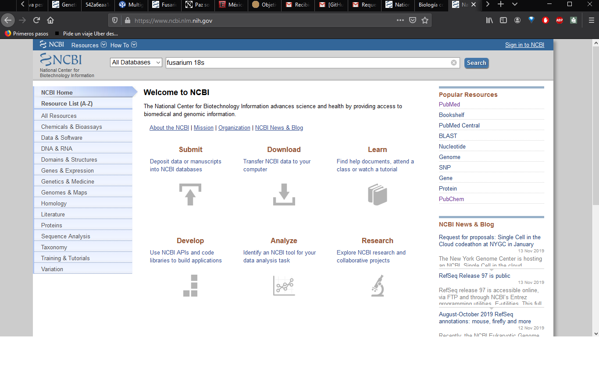

# Generación de base de datos Fusarium 
## Búsqueda de secuencias en NCBI 

Entra al sitio web de [NCBI](https://www.ncbi.nlm.nih.gov/) y busca el gen de interés con el que se realizará el árbol, específicando en primer lugar el organismo, en este ejemplo: Fusarium 16s  

