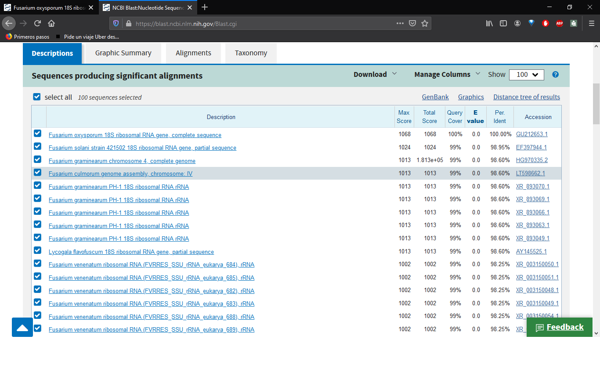

# Sesión 1: Generación de base de datos de Fusarium 

## Búsqueda de secuencias en NCBI 

Entra al sitio web de [NCBI](https://www.ncbi.nlm.nih.gov/) y busca el gen de interés con el que se realizará el árbol, específicando en primer lugar el organismo, en este ejemplo: Fusarium oxysporum 18s  Después, da click en el primer resultado titulado "Fusarium oxysporum 18S ribosomal RNA gene, complete sequence"  

Da click en donde dice rRNA, se seleccionará la secuencia y en la parte inferior aparecerá un recuadro da click en FASTA. Verás una página web nueva donde debes ver la secuencia de nucleótidos, selecciónala y cópiala en el portapapeles   

Ve al sitio web de [BLAST](https://blast.ncbi.nlm.nih.gov/Blast.cgi) y da click en Nucleotide BLAST y en el recuadro pega la secuencia de rRNA copiada anteriormente. Posteriormente, ve a la parte inferior de la página y da click en BLAST.   Los resultados aparecerán en unos minutos. Revisa los valores de E.value y Query cover. Selecciona 5 secuencias, da click en Download/FASTA aligned

# Sesión 5 Datos genómicos y Bioinformática   

## 5.1 ¿Qué es la bioinformática?  
Bioinformática es un conjunto de técnicas y algoritmos computacionales aplicadas a datos biológicos. Es una nueva área de estudio que combina biología molecular con ciencias computacionales. Un reto mayor que la bioinformática enfrenta es organizar la gran cantidad de información obtenida gracias a las nuevas tecnologías de secuenciación. Veamos ¿qué es la bioinformática? en esta [presentación](https://docs.google.com/presentation/d/1ELPMuwxz9no_BEKIPr4la0CtLt4d1LMicqorxCdjjDs/edit    

### La información Biológica se almacena en grandes bases de datos.  
Las bases de datos que almacenan información biológica pueden ser públicas o privadas. En ellas, los usuarios acumulan información de los organismos. Esta información es usualmente procesada por algún paquete de análisis para proporcionar una visualización.  

#### [The National Center for Biotechnology Information NCBI](https://www.ncbi.nlm.nih.gov/)  
NCBI es una de las grandes bases de datos biológicas contiene información de una extensa variedad de organismos incluyendo genes, genomas, proteinas, clasificación taxonómica, etc.  

Ejemplo de búsqueda en NCBI:
1. Búsqueda individual
   Ve a la página de NCBI y escribe mitochondrial en el buscador  
   ¿Qué resultados te salen?  
   
2. Búsqueda con modificadores AND y NOT   
 De hecho NCBI agrupa varias bases de datos, vamos a explorar taxonomy y nucleotide. Selecciona Nucleotide como base de datos y realiza la siguiente búsqueda.   
   
`"mitochondrial" [title]AND "D-loop"[title] NOT "segment"[title] AND "homo" [organism]  `    
  
¿Qué obtienes?  

### El formato fasta  
En bioinformática los formatos de los archivos son importantes para su posterior tratamiento. Nosotros necesitaremos el formato fasta para posteriores análisis. Por ello haremos un ejercicio para que te familiarices con él. Este formato consiste en una línea con el símbolo '>' antes del nombre identificador de la secuencia, y después un salto de línea y la secuencia como tal.  
  
Ejercicio  
  
De los resultados que visualizaste en tu segunda búsqueda, obtén la secuencia fasta de un D-loop mitocondrial y anótala en el documento colaborativo. Para ello debes hacer click en algún resultado de tu interés y después seleccionar FASTA en la parte superior izquierda.  

Descarga tu secuencia de tu correo y colócala en el Escritorio. ¿Es la secuencia de NCBI idéntica a la tuya?, ¿Qué diferencias ves? Anota tu conclusión en el documento colaborativo.  

## 5.2 La terminal de linux  

Para visualizar la calidad de nuestras secuencias vamos a visualizar un electroferograma. Para ello necesitamos iniciar el visualizador desde una terminal de linux. Por ello, a continuacion estudiaremos un poco de bash, el lenguaje de linux. Ahora bien, ¿Qué es una terminal de Linux?  
  
  La terminal es un medio para que el usuario interactúe con la computadora. Una terminal es un programa cuyo trabajo es ejecutar otros programas. La terminal más popular de linux se llama bash, aunque es antigua sigue siendo muy útil. Utilizar la terminal permite realizar acciones sobre muchos archivos, esto puede ahorrar una cantidad inimaginable de tiempo y errores manuales y al final puede ser la diferencia entre terminar o no una investigación. Para conocer más sobre la terminal de linux te recomendamos <a href="https://swcarpentry.github.io/shell-novice-es/"> Software Carpentry </a>  

### Moverse en el sistema de directorios  

> En esta introducción a BASH aprenderás a moverte en el sistema de directorios:  
> - Conocer tu ubicación en el sistema de directorios (pwd)  
> - Conocer el contenido del directorio en el que te encuentras.   
> - Cambiarte de directorio.  
  
Los tres comandos basicos para ubicarte y moverte en la estructura de directorios son:  
`cd `Cambio de directorio.    
`ls` Listado del contenido del directorio.    
`pwd`"Path to working directory" Muestra la ubicación del directorio.    

Abre una terminal y vamos a verificar en qué directorio estás :  
`$ pwd`  
 
El resultado debe ser algo similar a:   
`/home/usuario`  

Ese es el path absoluto donde estás ubicado. En este caso `home`  es el directorio raíz, que contiene a `usuario`.  

Ahora que ya sabemos nuestra ubicación, vamos a ver el contenido del directorio `/home/usuario`  
`$ ls `
`Desktop    Downloads         Music     Public  src        Videos`  
   
El resultado contiene varios nombres, por ejemplo puede contener Downloads, Desktop, examples.desktop y Documents. Muchos comandos de linux tienen modificadores. `ls` por ejemplo puede modificarse con `-F` y con `-l`. Con `ls -F` se añade una diagonal a todos los directorios, dejando sin diagonal a los elementos de la lista que son archivos. Con `ls -l` se obtiene una descripción más detallada de la fecha de creación del elemento, y de los permisos que tienen los uduarios. No tienes  que aprenderte todos los comandos ni modificadores, ni pasa nada si te equivocas. 
  
### Ejercicio 
Teclea el siguiente comando en la terminal
`$ ls -ñ`  
¿Qué pasa?   

Finalmente, necesitamos ubicarnos en el Desktop, que es el lugar donde vamos a trabajar. Para ello utilizaremos el comando `cd`.
1. Verifica que Desktop esté dentro del directorio `/home/usuario` ¿Qué comando utilizarías?  
2. Dirígete a directorio Desktop  
`$ cd Desktop`  
3. Verifica que estás ahí.  
`$ pwd`  
`/home/usuario/Desktop`  

¿Cuál es el contenido de Desktop? Ahora vamos a crear un directorio llamado BetterLab que es dónde trabajaremos de ahora en adelante. ¿Cómo crearías un directorio utilizando BASH?    

### Ejercicio 
Utiliza google para encontrar el comando crear un directorio en BASH.  

### Crear directorios
> Aprenderás a crear un directorio  

### Ejercicio  
Crea el directorio BetterLab  

1. Verifica que estás en el Desktop  
`$ pwd`  
`/home/usuario/Desktop`  
2. Verifica el contenido de Desktop  
`$ ls `  
3. Crea el directorio BetterLab  
`$ mkdir BetterLab`  
4. Verifica que se haya creado el nuevo directorio  
`ls `  
Debe aparecer ahora BetterLab como parte del contenido de `/home/usuario/Desktop`  
5. Ahora cámbiate al directorio BetterLab. Teclea exactamente  
`$ cd betterlab`  
¿Qué pasa?  

Linux es sensible a mayúsculas y minúsculas debes tener cuidado con ello. Tampoco se recomienda usar ñ,.,~ u otros caracteres que no sean alfanuméricos. De hecho cuando estás escribiendo bien un nombre puedes utilizar la tecla autcompletar (la de las dos flechas ubicada del lado izquierdo del teclado), y bash autompletará el nombre correcto. Otra recomendación es utilizar las flechas del teclado para recuperar los comandos escritos con anterioridad.  
  
Estamos listos para la siguientel lección, la visualización del electroferograma.   

