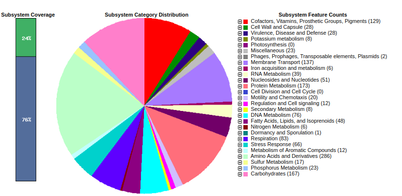

# Genómica comparada de Bacterias
## Genómica vs genética  
La genómica nos permite solucionar problemas que la genética no, ya que se comparan datos genómicos completos, en lugar de un sólo gen. Los genomas bacterianos suelen ser diferentes aunque sean de la misma especie, existen programas con interfaz web que nos permiten anotarlos y visualizarlos. Cuando son muchos genomas a procesar se utiliza la terminal de linux. Existen tanto desarrollos públicos generalistas como privados dedicados a alguna bacteria de interés.  

## Ejemplo de plataforma privada.  
Para estudiar _Clavibacter michiganensis michiganensis_ un patógeno del tomate hemos desarollado [Clavisual](https://nselem.github.io/clavigenomics/) que identifica genes marcadores adistintos niveles y realiza un árbol multilocus con una visualización de metadatos.  

## RAST Plataforma de anotación bacteriana  
Rast es una plataforma que una vez ensamblados los genomas procariontes, permite subir sus nucleótidos en formato fasta y los anota automáticamente comparándo los subsistemas del genoma a anotar con los subsistemas de otros genomas conocidos.  
  
### Ejemplo  
Hemos montado una cuenta de prueba para usuarios de este curso. Ve a la plataforma [RAST](http://rast.nmpdr.org/rast.cgi) y explórala.  
driscolls gd3f3lVN

1. Entra a RAST y busca un genoma de _Streptomyces_, después escoge un genoma de _Xanthomonas_   
  
2. Ve a la plataforma de visualización y compara tu genoma con el de algún compañero. ¿Tienen el mismo número de genes? ¿Cómo son sus subsistemas?   
    
    
3. Ahora utiliza la herramienta de comparación visual entre genomas. ¿Cuántos genomas puedes comparar?      
  
4. Utiliza Blast para localizar el gen RpoB de tu genoma. (Puedes obtener una secuencia query de RpoB de NCBI)  ¿Cómo son las vecindades genomicas?    
  
5. Descarga un genomas de Xanthomonas anotado en fasta y discute con tus compañeros como podrías utilizar los datos genómicos para mejorar la resolución de tu árbol de Xanthomonas.  
  
6. Descarga una secuencia genómica de NCBI en formato fasta o gbk y anótala en RAST.
  
RAST ha sido utilizado por otras plataformas genómicas, por ejemplo [PATRIC](https://www.patricbrc.org/) que puede ensamblar genomas bacterianos.  
